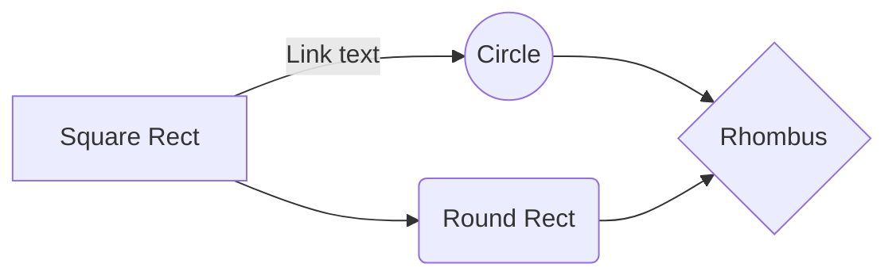

# dancoa
blog

```mermaid
graph LR
A[Square Rect] -- Link text --> B((Circle))
A --> C(Round Rect)
B --> D{Rhombus}
C --> D
```

Thanks to https://www.taniarascia.com/developing-a-wordpress-theme-from-scratch/
